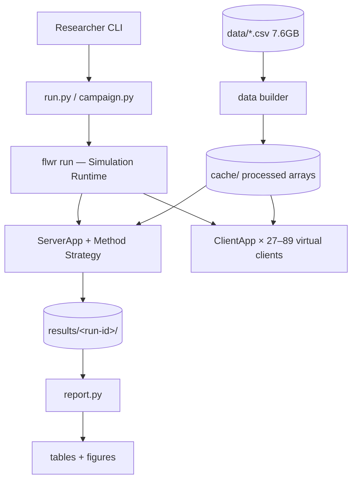
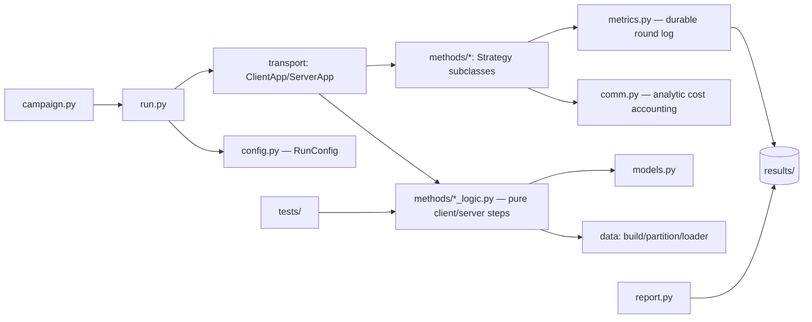
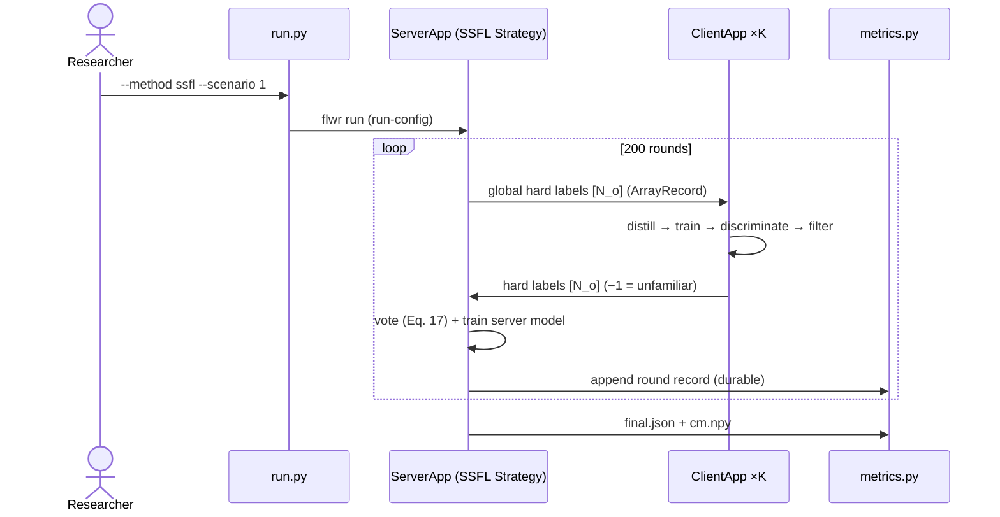

# Solution Design Document

## Validation Checklist

### CRITICAL GATES (Must Pass)

- [x] All required sections are complete
- [x] No [NEEDS CLARIFICATION] markers remain
- [x] Architecture pattern is clearly stated with rationale
- [x] **All architecture decisions confirmed by user**
- [x] Every interface has specification

### QUALITY CHECKS (Should Pass)

- [x] All context sources are listed with relevance ratings
- [x] Project commands are discovered from actual project files
- [x] Constraints → Strategy → Design → Implementation path is logical
- [x] Every component in diagram has directory mapping
- [x] Error handling covers all error types
- [x] Quality requirements are specific and measurable
- [x] Component names consistent across diagrams
- [x] A developer could implement from this design
- [x] Implementation examples use actual names (verified against the paper's equations)
- [x] Complex queries include traced walkthroughs with example data showing how the logic evaluates
- [x] **MECE: Components** — each component has a single distinct responsibility, every PRD requirement maps to exactly one component
- [x] **MECE: Interfaces** — no duplicate interfaces serving the same path, all communication paths documented
- [x] **MECE: Data Models** — each entity owns a distinct slice of the domain, all required data is modeled
- [x] **MECE: Acceptance Criteria** — each EARS criterion is unique, every PRD criterion has a corresponding system-level criterion

---

## Constraints

- CON-1: Stack is fixed — Python 3.12 (uv-managed), PyTorch ≥2.9, `flwr[simulation]==1.32.1` pinned exactly (Message API only; the 1.x line has removed/renamed APIs repeatedly).
- CON-2: Paper hyperparameters are immutable defaults: Adam lr=1e-4, batch 80, 5 local epochs, 200 rounds, DS-FL temperature softmax.
- CON-3: Hardware baseline is Apple M4 / 10 cores / 16 GB / MPS; Ray does not schedule MPS as a GPU, so device selection happens inside client code. CUDA cloud is an escape hatch, not a requirement.
- CON-4: Raw data is the existing 7.6 GB `data/*.csv` (89 files); devices 3 and 7 have no mirai traffic (6 classes instead of 11).
- CON-5: Runs are hours long — per-round metrics must be durable (append-on-write), and the campaign must be resumable.
- CON-6: No labels from the open split may reach any training path (semisupervised integrity).

## Implementation Context

### Required Context Sources

#### Documentation Context
```yaml
- doc: "Semisupervised_Federated-Learning-Based_Intrusion_Detection_Method_for_Internet_of_Things .pdf"
  relevance: CRITICAL
  why: "Source of truth: Eqs. 1–19, Table I model, Algorithm 1, scenario definitions, all target numbers"

- url: https://flower.ai/docs/framework/how-to-run-simulations.html
  relevance: HIGH
  why: "Simulation runtime, num-supernodes, client resources"

- url: https://flower.ai/docs/framework/explanation-flower-strategy-abstraction.html
  relevance: HIGH
  why: "Strategy.configure_train/aggregate_train contract used by all four methods"

- url: https://flower.ai/docs/framework/how-to-design-stateful-clients.html
  relevance: HIGH
  why: "Context.state persistence semantics and limits (in-memory, run-scoped)"

- url: https://flower.ai/docs/framework/ref-api/flwr.app.ArrayRecord.html
  relevance: MEDIUM
  why: "Sanctioned carrier for non-parameter arrays (hard labels, logits)"
```

#### Code Context
```yaml
- file: data/features.csv
  relevance: MEDIUM
  why: "Feature name order — defines the 115-column layout reshaped to 23×5 (Eq. 19)"

- file: data/data_summary.csv
  relevance: LOW
  why: "Row counts per file for builder sanity checks"
```
No existing source code — greenfield project; conventions are set by this SDD.

### Implementation Boundaries

- **Must Preserve**: raw `data/*.csv` (read-only); the paper's protocol and hyperparameters.
- **Can Modify**: everything under `src/`, `tests/`, `results/`, `cache/`, `pyproject.toml`.
- **Must Not Touch**: the PDF, `.start/` documents other than via the spec workflow.

### External Interfaces

#### System Context Diagram



#### Interface Specifications

```yaml
inbound:
  - name: "Researcher CLI"
    type: process invocation
    format: "argparse flags → flwr run --run-config TOML-style overrides"
    authentication: none (local)
    data_flow: "method/model/scenario/seed/ablation flags/rounds/device"

outbound: []   # no external services; fully local

data:
  - name: "Processed dataset cache"
    type: "npz/npy + JSON manifest under cache/"
    connection: numpy memory-mapped load
    data_flow: "X (float32, N×23×5), y (int64), split indices, per-scenario client→index partitions"

  - name: "Run results store"
    type: "results/<run-id>/ directory: config.json, rounds.jsonl, final.json, cm.npy"
    connection: append-on-write files
    data_flow: "per-round metrics (durable), final metrics, confusion matrix"
```

### Cross-Component Boundaries (if applicable)

Single-owner project; the one hard internal contract: **method strategies and client logic communicate only through Message payloads defined in `payloads.py`** (names, dtypes, shapes). Changing a payload shape requires updating its single definition and the comm-cost accounting together.

### Project Commands

```bash
# Core Commands (greenfield — defined by this design)
Install: uv sync                        # creates .venv, Python 3.12, pinned deps
Build data: uv run python -m ssfl.data.build   # one-time CSV → cache/
Test:    uv run pytest                  # smoke suite, <5 min
Run one: uv run python -m ssfl.run --method ssfl --scenario 1 --seed 0
Campaign: uv run python -m ssfl.campaign       # all ~30 runs, resumable
Report:  uv run python -m ssfl.report          # tables II–IV + figs 3–6
Timing:  uv run python -m ssfl.run --method ssfl --scenario 1 --rounds 5 --timing
```

## Solution Strategy

- **Architecture Pattern**: Layered simulation harness — (1) a pure-PyTorch domain core (`data`, `models`, `methods/*_logic.py`) with no Flower imports, and (2) a thin Flower transport shell (ClientApp/ServerApp/Strategies) that moves ndarrays. All science lives in the core; the shell only routes.
- **Integration Approach**: Greenfield; Flower 1.32 Message API is the only framework coupling, isolated to `transport/`.
- **Justification**: The four methods differ only in *what* is exchanged and *how it's aggregated*; a common round loop with method-specific payload/aggregate hooks avoids four divergent codebases and makes the ablation flags (which tweak SSFL internals) local to SSFL logic. Keeping domain logic Flower-free makes the 2-round smoke tests runnable without Ray and survives Flower API churn.
- **Key Decisions**: see ADR-1…ADR-8 (Architecture Decisions section).

## Building Block View

### Components



### Directory Map

**Component**: ssfl (single package)
```
.
├── pyproject.toml                 # NEW: uv project, flwr==1.32.1 pin, [tool.flwr.app] config
├── src/ssfl/
│   ├── config.py                  # NEW: RunConfig dataclass (method, model, scenario, seed, flags), run-id derivation
│   ├── data/
│   │   ├── build.py               # NEW: CSV → mini-N-BaIoT cache (sample, normalize, reshape, split)
│   │   ├── partition.py           # NEW: scenario 1/2/3 client partitions (shards / per-class / Dirichlet)
│   │   └── loader.py              # NEW: memmap loaders; client/private, open, test views
│   ├── models.py                  # NEW: TableI-CNN (11/2 heads), MLP, LSTM; device helper
│   ├── methods/
│   │   ├── payloads.py            # NEW: payload name/dtype/shape contract per method
│   │   ├── base.py                # NEW: shared Strategy plumbing (round loop, evaluate_fn, metrics hook)
│   │   ├── fl.py + fl_logic.py    # NEW: FedAvg (Eq. 1)
│   │   ├── fd.py + fd_logic.py    # NEW: per-class avg logits (Eqs. 2–4)
│   │   ├── dsfl.py + dsfl_logic.py# NEW: open-set logits, ERA temperature softmax (Eqs. 5–10)
│   │   └── ssfl.py + ssfl_logic.py# NEW: discriminator, filter, vote, distill (Eqs. 11–18) + ablation flags
│   ├── transport/
│   │   ├── client_app.py          # NEW: ClientApp @app.train dispatch → *_logic; Context.state/ckpt handling
│   │   └── server_app.py          # NEW: ServerApp @app.main → strategy.start(evaluate_fn=…)
│   ├── comm.py                    # NEW: analytic bytes/round per method; C@x from accuracy curves
│   ├── metrics.py                 # NEW: rounds.jsonl appender, final.json, confusion matrix
│   ├── run.py                     # NEW: CLI → flwr run with run-config; --timing mode
│   ├── campaign.py                # NEW: ordered run list, skip-completed, progress
│   └── report.py                  # NEW: Tables II–IV + Figs 3–6, paper values inline, missing-run listing
├── tests/                         # NEW: data invariants + 2-round micro-runs (logic layer, no Ray)
├── cache/                         # generated, gitignored
└── results/                       # generated, one dir per run-id
```

### MECE Check: Components
- [x] Each component has a single, distinct responsibility (no overlap)
- [x] Every PRD requirement maps to exactly one component: F1→data/, F2→models.py, F3→methods/+transport/, F4→run.py+config.py+metrics.py, F5→ssfl.py flags, F6→comm.py, F7→report.py, F8→tests/, F9→run.py --timing, F10→campaign.py
- [x] No two components own the same domain logic

### Interface Specifications

#### Interface Documentation References

No pre-existing interface docs. The payload contract (below) is the project's internal interface documentation.

#### Data Storage Changes

```yaml
# File-based storage only (no database)
cache/:
  mini.npz:            # X: float32 [N,23,5]; y: int64 [N]; device_id: int8 [N]
  splits.json:         # per-subset index lists: private/open/test (70/10/20)
  scenario_<s>.json:   # client_id → private sample indices; s ∈ {1,2,3}
  meta.json:           # seed, class map (11 global classes), per-device class counts, feature order hash

results/<run-id>/:     # run-id = {method}-{model}-s{scenario}-seed{seed}[-flags]
  config.json          # full resolved RunConfig
  rounds.jsonl         # one line/round: {round, acc, wall_s, ssfl_diag?}
  final.json           # accuracy, macro-F1, precision, per-class metrics
  cm.npy               # confusion matrix on test set
  ckpt/                # per-client model/optimizer state (client_<id>.pt), server model
```

#### Internal API Changes

```yaml
# Payload contract (methods/payloads.py) — ndarray shapes over ArrayRecord
FL:
  server→client: model weights (list[ndarray], Table I CNN state)
  client→server: model weights + num_examples (MetricRecord)
FD:
  server→client: global per-class avg logits (float32 [L, L])
  client→server: local per-class avg logits (float32 [L, L])  # zero row when class absent (Eq. 3)
DS-FL:
  server→client: global soft labels on open set (float32 [N_o, L])  # after ERA softmax (Eq. 8)
  client→server: local logits on open set (float32 [N_o, L])
SSFL:
  server→client: global hard labels (int64 [N_o], −1 = unlabeled this round)
  client→server: filtered hard labels (int64 [N_o], −1 = unfamiliar)
SSFL soft-label ablation:
  client→server: soft labels rounded to x decimals (float32 [N_o, L]); cost model uses x
```

#### Application Data Models

```pseudocode
ENTITY: RunConfig (NEW)
  FIELDS: method, model, scenario, seed, rounds=200, lr=1e-4, batch=80,
          local_epochs=5, threshold="median"|0.7|0.8|0.9,
          no_voting, no_discriminating, simply_filtering: bool,
          label_mode="hard"|"soft2"|"soft4"|"soft6"|"soft8",
          device="auto", num_parallel_clients
  BEHAVIORS: run_id(), to_flwr_run_config(), validate()   # e.g. ablation flags only with method=ssfl

ENTITY: ClientState (NEW; per client, persisted in ckpt/)
  FIELDS: classifier state_dict, discriminator state_dict (ssfl only),
          optimizer states, rng state
  BEHAVIORS: load(partition_id), save(partition_id)

ENTITY: RoundRecord (NEW; one JSONL line)
  FIELDS: round, test_acc, wall_s,
          ssfl_diag: {unfamiliar_per_client: stats, unlabeled_after_vote, vote_agreement}
```

#### Integration Points

```yaml
# Inter-component communication
- from: run.py
  to: flwr Simulation Runtime
  protocol: subprocess `flwr run` with --run-config (validated by config.py first)
  data_flow: "resolved RunConfig scalars"

- from: ServerApp strategy
  to: ClientApp instances
  protocol: flwr Message API (ArrayRecord payloads per contract above)
  data_flow: "method-specific arrays; ConfigRecord carries round number + flags"

# External systems: none
```

### MECE Check: Interfaces & Data Models
- [x] No two interfaces serve the same consumer-to-provider path
- [x] All component-to-component paths documented (CLI→flwr, server↔client, components→results/cache)
- [x] Each data entity owns a distinct slice (config vs per-client state vs per-round metrics)
- [x] All data referenced in interfaces and acceptance criteria is modeled

### Implementation Examples

#### Example: SSFL server-side majority vote (Eq. 17) with tie-break

**Why this example**: the vote is the heart of the method and the paper doesn't define tie-breaks or the zero-vote case; this pins the judgment calls.

```python
def vote(client_labels: np.ndarray, num_classes: int) -> np.ndarray:
    """client_labels: int64 [K, N_o], entries in {-1, 0..L-1}; -1 = unfamiliar (never counted).
    Returns int64 [N_o] global labels; -1 where no client voted."""
    N_o = client_labels.shape[1]
    counts = np.zeros((N_o, num_classes), dtype=np.int64)
    for k_row in client_labels:                     # K rows
        valid = k_row >= 0
        np.add.at(counts, (np.nonzero(valid)[0], k_row[valid]), 1)
    winners = counts.argmax(axis=1)                 # ties → lowest class index (deterministic)
    winners[counts.sum(axis=1) == 0] = -1           # zero votes → unlabeled this round
    return winners
```

**Traced walkthrough** (K=3 clients, L=3 classes, N_o=4 samples):
- labels = [[2, −1, 0, 1], [2, −1, 1, 1], [0, −1, 1, 2]]
- sample 0: votes {2:2, 0:1} → 2. sample 1: no votes → −1 (excluded from distillation this round).
- sample 2: votes {0:1, 1:2} → 1. sample 3: votes {1:2, 2:1} → 1.
- Tie case [0-vote=1, 1-vote=1]: argmax picks class 0 — documented deterministic bias, seed-stable.

**Edge cases**: all clients return −1 for all samples → vote returns all −1 → distillation is skipped that round and the round still logs metrics (server model unchanged). A client erroring mid-round (`msg.has_error()`) is dropped from `client_labels` for that round and counted in the round record.

#### Example: SSFL client round (Algorithm 1 unrolled into one `fit`)

**Why this example**: the paper's round ends with distillation *after* the vote; Flower gives one train call per round — the unroll must be exact or convergence behavior changes.

```python
def ssfl_client_round(state, private_ds, open_X, global_labels, cfg, round_t):
    # 1. Distill with labels voted at end of round t-1 (skip at t=1; skip samples with -1)
    if round_t > 1:
        mask = global_labels >= 0
        train_ce(state.classifier, open_X[mask], global_labels[mask], epochs=1, cfg)
    # 2. Supervised training on private labeled data (Eq. 11)
    train_ce(state.classifier, private_ds.X, private_ds.y, epochs=cfg.local_epochs, cfg)
    # 3. Confidence scores on open set (Eq. 12); threshold = per-client median this round
    conf, preds = predict_confidence(state.classifier, open_X)
    theta = np.median(conf) if cfg.threshold == "median" else cfg.threshold
    # 4. Discriminator: unfamiliar = low-confidence open samples; familiar = private samples (Eqs. 13–14)
    train_ce(state.discriminator, stack(open_X[conf < theta], private_ds.X),
             labels=stack(ones, zeros), epochs=1, cfg)
    # 5. Filter (Eqs. 15–16): discriminator's verdict decides, not the threshold
    unfamiliar = predict_class(state.discriminator, open_X) == 1
    hard = np.where(unfamiliar, -1, preds)
    return hard  # int64 [N_o]
```

Judgment calls pinned here (paper is silent): distillation/discriminator train for **1 epoch** each (5 epochs applies to the supervised step, per "local train epochs"); optimizers are **re-created each round** (fresh Adam state — standard FL practice); distillation loss is **cross-entropy on hard labels**.

## Runtime View

### Primary Flow

#### Primary Flow: one full SSFL experiment
1. Researcher: `uv run python -m ssfl.run --method ssfl --scenario 1 --seed 0`
2. `run.py` validates config, creates `results/<run-id>/`, writes `config.json`, launches `flwr run` with run-config.
3. ServerApp builds the SSFL strategy, `strategy.start(num_rounds=200, evaluate_fn=central_eval)`.
4. Each round: strategy broadcasts global hard labels (ConfigRecord: round, flags) → each virtual client executes `ssfl_client_round` (loading/saving its `ckpt/client_<id>.pt`) → strategy votes, trains server model on labeled open samples, `evaluate_fn` scores it on the test set → `metrics.py` appends the round line.
5. After round 200: `final.json` + `cm.npy` written; process exits 0.



### Error Handling

- **Invalid CLI input** (unknown method, ablation flag with non-SSFL method, threshold typo): `config.validate()` rejects before any launch, with the exact allowed values.
- **Missing cache**: `run.py` fails fast with "run `ssfl.data.build` first" (does not silently rebuild — the build is a 7.6 GB, minutes-long step the researcher should invoke knowingly).
- **Client failure mid-round**: reply messages with `has_error()` are excluded from aggregation; the round record notes `failed_clients`; the run continues (FL is tolerant to stragglers by design).
- **Crash mid-run**: `rounds.jsonl` retains all completed rounds (append + flush per round). Restart policy: same run-id restarts from round 1 with identical seed after moving the stale dir to `<run-id>.aborted-<ts>`; `campaign.py` treats only runs with `final.json` as complete. (Mid-run resume is deliberately out of scope — a restarted 200-round run is cheaper than validating resumed optimizer/RNG state everywhere.)
- **OOM at 89 clients**: per-client state lives on disk, not RAM (ADR-3); Ray parallelism is capped by `num_parallel_clients` (default 8 on the M4).

### Complex Logic (if applicable)

Covered by the two traced examples above (vote; unrolled client round). DS-FL's ERA (Eq. 8) is a one-line temperature softmax with T<1 applied to averaged logits — no further walkthrough needed.

## Deployment View

- **Environment**: local macOS (M4) by default; any CUDA Linux box as drop-in alternative (same commands; `--device cuda`, `num_gpus` fraction via federation config).
- **Configuration**: all in `pyproject.toml` (flwr federation: num-supernodes per scenario) + CLI flags; no env vars except optional `PYTORCH_ENABLE_MPS_FALLBACK=1`.
- **Dependencies**: none external — fully offline after `uv sync`.
- **Performance**: measured 3.8 ms/step (MPS) / 24.5 ms/step (CPU); projected 2.7–9 h per 200-round run; clients default to CPU with ~8-way parallelism (`OMP_NUM_THREADS=1` per worker), server eval on MPS; `--timing` mode re-measures and projects before committing (PRD F9).

## Cross-Cutting Concepts

### Pattern Documentation

No pre-existing project patterns (greenfield). New patterns established by this SDD: transport/domain separation (`methods/*_logic.py` pure, `transport/` Flower-only) and the single payload contract (`payloads.py`).

### User Interface & UX (if applicable)

Not applicable — CLI only. CLI UX: every run prints its run-id, per-round one-line progress (round, acc, ETA), and ends with the results path.

### System-Wide Patterns

- **Security**: not applicable beyond CON-6 (open-split labels never enter training paths; enforced by loader returning unlabeled views and a test asserting it).
- **Error Handling**: fail-fast before launch; tolerate-and-log during rounds; never leave a half-written `final.json` (write temp + rename).
- **Performance**: memmap dataset views (no per-run CSV parsing); tensors created once per client round; analytic comm accounting (no payload sniffing).
- **Reproducibility (this project's i18n)**: one `seed_everything(seed, client_id, round)` discipline — every stochastic site (partitioning, shuffling, init, Dirichlet draw) derives from the run seed; `meta.json` and `config.json` capture everything needed to regenerate.
- **Logging/Auditing**: `rounds.jsonl` + `ssfl_diag` fields are the audit trail for divergence debugging (PRD tracking table).

### Multi-Component Patterns (if applicable)

Not applicable — single package, single process tree.

## Architecture Decisions

- [x] ADR-1 **FL framework**: Flower `flwr[simulation]==1.32.1`, Message API only (ClientApp/ServerApp + `flwr run`), exact pin.
  - Rationale: user-selected stack; 1.32 Message API is the first Flower API where non-weight payloads are first-class (ArrayRecord); legacy `start_simulation` is deprecated and community FedMD code targets removed APIs.
  - Trade-offs: framework overhead vs. plain loops; heavy API churn risk contained by the exact pin and `transport/` isolation.
  - User confirmed: 2026-07-06

- [x] ADR-2 **Payload transport**: all method payloads (weights, logits, hard labels) travel as `ArrayRecord` ndarrays under a single contract module (`payloads.py`).
  - Rationale: ArrayRecord is documented for "non-parameter arrays"; one contract file keeps comm-cost accounting and strategies in lockstep.
  - Trade-offs: no type safety beyond the contract's own checks.
  - User confirmed: 2026-07-06

- [x] ADR-3 **Per-client state**: disk checkpoints `ckpt/client_<id>.pt` keyed by partition-id are the primary store; `Context.state` holds only scalars (round bookkeeping).
  - Rationale: 89 clients × (2 models + optimizer) in RAM-resident Context.state risks OOM on 16 GB; disk survives crashes and enables post-mortem inspection; Ray actors are ephemeral so in-process caches are unreliable anyway.
  - Trade-offs: ~1 MB × 89 I/O per round (negligible vs. training time).
  - User confirmed: 2026-07-06

- [x] ADR-4 **Method structure**: pure-logic modules (`*_logic.py`, no Flower imports) + thin Strategy subclasses of a shared base; SSFL ablations are flags inside `ssfl_logic`, not separate methods.
  - Rationale: the four methods share the round skeleton and differ only in payload/aggregation; pure logic is unit-testable without Ray (PRD F8's <5-min suite depends on this).
  - Trade-offs: one indirection layer between transport and science.
  - User confirmed: 2026-07-06

- [x] ADR-5 **Data cache**: one-time build to `cache/mini.npz` (float32 X, int64 y) + JSON split/partition indices; loaders memmap; builder is seed-fixed and idempotent.
  - Rationale: 7.6 GB CSV parsing must happen exactly once; index-based partitions make all three scenarios reuse one array; byte-identical rebuild satisfies PRD F1's determinism AC.
  - Trade-offs: cache invalidation is manual (delete `cache/`), acceptable for one researcher.
  - User confirmed: 2026-07-06

- [x] ADR-6 **Device policy**: clients train on CPU (Ray-parallel, default 8 workers, `OMP_NUM_THREADS=1`); server-side distillation/evaluation uses MPS; `--device` overrides; on CUDA both sides use the GPU with fractional `num_gpus`.
  - Rationale: Ray cannot schedule MPS; 89 concurrent clients sharing one MPS device contend, while 8 parallel CPU clients ≈ MPS throughput per the benchmark; the timing pilot (PRD F9) validates before the campaign.
  - Trade-offs: two device paths to test (covered by F2's device AC).
  - User confirmed: 2026-07-06

- [x] ADR-7 **Metrics durability**: append-one-JSONL-line-per-round with flush; `final.json` via temp-file rename; campaign completeness = presence of `final.json`.
  - Rationale: satisfies interrupted-run journey with zero infrastructure; JSONL is trivially consumed by `report.py`/pandas.
  - Trade-offs: no live dashboard (out of scope).
  - User confirmed: 2026-07-06

- [x] ADR-8 **Paper-silent judgment calls** (documented in code and README): vote ties → lowest class index; zero-vote samples → unlabeled that round; distillation & discriminator train 1 epoch/round (5 epochs is supervised only); optimizers re-created each round; distillation loss = cross-entropy on hard labels; mini-N-BaIoT sampling = first 1000 rows per device-category (seed-fixed).
  - Rationale: all are the most conventional readings; centralizing them makes divergence-hunting tractable (change one, re-run, compare).
  - Trade-offs: any one call could be the source of a paper-vs-ours gap; the `ssfl_diag` audit trail exists to localize that.
  - User confirmed: 2026-07-06

## Quality Requirements

- **Performance**: full smoke suite < 5 min on the M4; one 200-round run ≤ 9 h locally; dataset build ≤ 15 min; report generation < 1 min.
- **Usability**: any experiment reproducible from a single CLI line; report shows ours-vs-paper deltas without manual lookup.
- **Security**: open-split labels provably absent from training paths (asserted by test); raw data opened read-only.
- **Reliability**: crash loses at most the in-flight round; campaign re-invocation never re-runs completed runs nor double-writes results; identical config+seed ⇒ identical `rounds.jsonl`.

## Acceptance Criteria

**Main Flow Criteria: [PRD F1–F4 — data, models, methods, runner]**
- [ ] WHEN the builder runs on `data/*.csv`, THE SYSTEM SHALL produce a cache with 89 subsets × 1000 samples, values in [0,1], shape [N,23,5], and 70/10/20 disjoint splits, byte-identical across rebuilds with the same seed.
- [ ] WHEN scenario 1/2/3 partitioning is requested, THE SYSTEM SHALL emit 27/89/89 client index sets using shards / one-class / Dirichlet(0.1) respectively.
- [ ] WHEN the CNN classifier processes a [B,23,5] batch, THE SYSTEM SHALL produce activations matching Table I at every layer and 11 (classifier) or 2 (discriminator) outputs.
- [ ] WHEN any of the four methods runs a round, THE SYSTEM SHALL exchange exactly the payloads defined in `payloads.py` for that method and aggregate per the paper's equations.
- [ ] WHEN an SSFL round completes, THE SYSTEM SHALL have evaluated the server classifier (not any client) on the test set and appended a durable round record.
- [ ] THE SYSTEM SHALL default all hyperparameters to the paper's values (Adam 1e-4, batch 80, 5 local epochs, 200 rounds).
- [ ] WHEN a run is re-executed with identical config and seed, THE SYSTEM SHALL reproduce identical per-round metrics.

**Ablation & Accounting Criteria: [PRD F5–F6]**
- [ ] WHERE `--no-discriminating` / `--no-voting` / `--simply-filtering` / `--threshold x` / soft-label mode is enabled, THE SYSTEM SHALL alter only the targeted mechanism, leaving the rest of the SSFL round unchanged.
- [ ] WHEN a run completes, THE SYSTEM SHALL report cumulative MB per round derived from the payload contract, and C@50/C@75/C@Top-Acc, marking unreached targets as unreached.

**Reporting & Testing Criteria: [PRD F7–F10]**
- [ ] WHEN the report runs over `results/`, THE SYSTEM SHALL regenerate Tables II–IV and Figures 3–6 with paper values side-by-side and list missing runs instead of failing.
- [ ] WHEN the smoke suite runs, THE SYSTEM SHALL verify all data invariants and complete a 2-round micro-run for each method plus one ablation variant in under 5 minutes, without Ray.
- [ ] WHEN `--timing` mode runs, THE SYSTEM SHALL report measured s/round and projected duration for every planned campaign run.
- [ ] WHEN the campaign script is re-invoked, THE SYSTEM SHALL skip runs whose `final.json` exists and show done/remaining progress.

**Error Handling Criteria: [PRD journeys — recovery]**
- [ ] IF a client reply carries an error, THEN THE SYSTEM SHALL exclude it from aggregation, record the failure count, and continue the round.
- [ ] IF a run crashes mid-flight, THEN THE SYSTEM SHALL preserve all previously appended round records and never leave a partial `final.json`.
- [ ] IF the vote yields no label for a sample (all −1), THEN THE SYSTEM SHALL exclude that sample from distillation for the round and continue.
- [ ] IF the dataset cache is missing, THEN THE SYSTEM SHALL abort before launching any simulation with instructions to build it.

**Edge Case Criteria: [PRD detailed spec]**
- [ ] WHILE a client holds a single class (Scenario 2), THE SYSTEM SHALL complete training, confidence scoring, and filtering without degenerate failures.
- [ ] WHILE devices 3/7 (6 classes) are processed, THE SYSTEM SHALL handle absent classes (FD zero-vector rule, Eq. 3 note) without crashing.
- [ ] IF two classes tie in a vote, THEN THE SYSTEM SHALL resolve deterministically (lowest class index) and identically across reruns.

### MECE Check: Acceptance Criteria
- [x] Each EARS criterion specifies a unique system behavior
- [x] Every PRD acceptance criterion has a corresponding EARS criterion (F1–F10, journeys, edge cases)
- [x] Criteria collectively cover happy path, error handling, and edge cases for every component

## Risks and Technical Debt

### Known Technical Issues

- Installed global flwr 1.9.0 is broken against numpy 2.4 — irrelevant once the uv venv pins 1.32.1, but never run the project against the system environment.
- MPS op coverage gaps in PyTorch may hit LSTM ops → `PYTORCH_ENABLE_MPS_FALLBACK=1` documented; LSTM runs may fall back to CPU per-op.

### Technical Debt

- No mid-run resume (restart-from-zero policy, ADR-7/Error Handling) — acceptable at ≤9 h/run; revisit only if runs move to >24 h hardware.
- Manual cache invalidation (delete `cache/`) — fine for one researcher; a content hash in `meta.json` guards against silently stale caches.

### Implementation Gotchas

- **Flower run-config passes scalars only** — ablation flags must be encoded as strings/bools in run-config, reassembled by `config.py`; don't try to ship arrays through it (that's what ArrayRecord is for).
- **Ray workers inherit no globals** — anything a client needs must come from the cache files or the Message; module-level state silently resets per actor.
- **`np.argmax` tie behavior** is the tie-break rule — do not "fix" it to random choice; reproducibility depends on it.
- **DS-FL ERA direction**: Eq. 8's T<1 *sharpens* (reduces entropy); using T>1 (the usual distillation softening) inverts the mechanism and will silently degrade DS-FL below paper values.
- **FD's zero-vector rule** (client lacks class l → upload 0-vector, and Eq. 4 subtracts own logits before averaging) — easy to miss and it changes FD results materially.
- **Scenario 2 client count is 89, not 99**: devices 3/7 contribute 6 clients each (one per present class).
- **The 23×5 reshape order** must follow Eq. 19's column layout (features 0–22 in column 1, 23–45 in column 2, …); a transposed reshape still trains but breaks Table I comparability.

## Glossary

### Domain Terms

| Term | Definition | Context |
|------|------------|---------|
| N-BaIoT | Public IoT botnet-traffic dataset: 9 devices, benign + gafgyt (5) + mirai (5) categories, 115 statistical features | Raw input in `data/` |
| mini-N-BaIoT | The paper's subsample: 1000 records per device-category subset | What the builder produces |
| Open set (D^o) | Unlabeled data shared by all clients (10% split); labels stripped | Distillation substrate |
| Private set (D^p) | Client-local labeled data (70% split), non-IID partitioned | Supervised training |
| Scenario 1/2/3 | Non-IID partition schemes: label-sorted shards (27 clients) / one class per client (89) / Dirichlet α=0.1 (89) | Experiment axes |
| Unfamiliar sample | Open-set sample a client's discriminator rejects (label −1) | Excluded from that client's vote |
| Global hard labels | Server's majority-voted labels on the open set | Distillation targets |

### Technical Terms

| Term | Definition | Context |
|------|------------|---------|
| FD | Federated Distillation (Jeong et al.): exchange per-class average logits | Baseline 2 |
| DS-FL | Distillation-Based Semisupervised FL (Itahara et al.): exchange open-set logits + ERA | Baseline 3 |
| ERA | Entropy Reduction Aggregation — temperature softmax with T<1 on averaged logits (Eq. 8) | DS-FL aggregation |
| ArrayRecord | Flower 1.32 container for ndarrays in Messages (weights or arbitrary arrays) | All payloads |
| Context.state | Flower per-client RecordDict persisting across rounds within one run (in-memory) | Scalars only (ADR-3) |
| C@x | Cumulative communication cost (MB) until test accuracy first reaches x% | Table IV metric |

### API/Interface Terms

| Term | Definition | Context |
|------|------------|---------|
| run-config | `flwr run --run-config` scalar overrides read via `context.run_config` | CLI → apps |
| partition-id | `context.node_config["partition-id"]` — stable virtual-client index | Keys data partitions and checkpoints |
| run-id | `{method}-{model}-s{scenario}-seed{seed}[-flags]` | Results directory naming and campaign resume |
